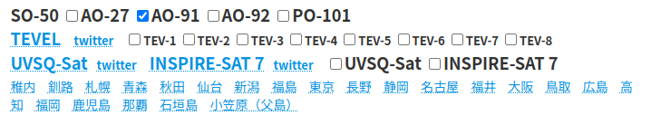

import MdTable from "@/components/MdTable.astro";
export const components = { table: MdTable };

# 衛星通信にハマっている話

これは[大学無線部 Advent Calendar 2023](https://adventar.org/calendars/9345)の10日目の記事です。

## 自己紹介

こんにちは、東京大学アマチュア無線クラブに所属している、JJ1FXHです。今回は、私が現在ハマっている衛星通信について紹介していきたいと思います。

## 衛星通信とは

衛星通信とは、人工衛星に積まれているレピーターを介して交信を行う通信方式のことです。レピーターは、144MHzで送信すると430MHzで帰ってくるものと、430MHzで送信すると144MHzで帰ってくるものがあり、またFMを中継するものと、SSB/CWを中継するものがあります。私達アマチュア無線家が使える衛星は主に地球から400km〜1500km離れた場所にあるので、普段ハンディー機で交信出来ないような見通し範囲外の局と交信出来ます。

それでは、私の普段の交信スタイルを紹介していきます。

## 必要なもの

1. ハンディー機

私は、ICOMのID-50を使っています。衛星通信では、送信しながら自分の中継された電波を聞くのが基本とされているのですが、ID-50には送信しながら受信する機能が無いため、自分の電波が衛星まで届いているかのチェックは出来ないでいます。ID-50のようなニ波同時受信機能のあるハンディー機だと、送受信時にバンドを切り替える必要が無いため、操作の複雑性が減ります。しかし、ニ波同時受信が無くても、手動で送信時と受信時に周波数を切り替えれば交信は可能だと思われます。ハンディー機をニ台持っている方は、一方を送信用、もう一方を受信用とすることで、自分の電波が中継されるのを聞きながら交信することができます。この場合、アンテナ次第ではデュープレクサを使う必要があります。

2. アンテナ

アンテナは、144/430の両方で使える八木アンテナを使っています。具体的には、[A1430S7](https://www.diamond-ant.co.jp/support/end_3.html)という第一電波工業のアンテナを使っています。このアンテナは144MHzが3エレ、430MHzが4エレとなっており、非常に使いやすいのですが、残念ながら現在は生産終了しています。現在販売されている144/430共用八木の中では、DO-2B8が一番近いです。また、アンテナを自作している人もいます([アンテナ自作例](https://www.jamsat.or.jp/features/cheapyagi/leo.html))。このあたりは多分に工夫の余地があると思います。

## 準備

### 衛星がいつ来るかを調べる

現在使用できる主なFM衛星は、SO-50, Tevelシリーズ, ISS, AO-91, PO-101です。それぞれの衛星の使用周波数と主な特徴は以下の通りです。

| 衛星名             | 送信周波数(トーン)/受信周波数 | 特徴                                                                                                                                                                                                |
| ------------------ | ----------------------------- | --------------------------------------------------------------------------------------------------------------------------------------------------------------------------------------------------- |
| SO-50              | 145.850(67Hz)/436.795         | ダウンリンク(衛星から送られてくる電波)が弱い。                                                                                                                                                      |
| Tevel-1 〜 Tevel-8 | 145.970(無し)/436.400         | ダウンリンクは強め。スケジュールにより切り替え運用されている。[運用状況](https://www.df2et.de/tevel/)をチェック。Tevelの情報は[こちら](https://twitter.com/DavidGr06270644)でもツイートされている。 |
| ISS                | 145.990(67Hz)/437.800         | ダウンリンクは5Wのため非常に強い。動作状況は[こちら](https://www.ariss.org/current-status-of-iss-stations.html)を参照。                                                                             |
| AO-91              | 435.250(67Hz)/145.960         | 衛星側にAFCがあるため、後述するドップラーシフトをほとんど気にする必要が無い。バッテリーの劣化のため、日照時のみ使用できる。                                                                         |
| PO-101             | 437.500(141.3Hz)/145.900      | ダウンリンクが強い。[運用状況](https://www.df2et.de/tevel/)をチェック。                                                                                                                             |

他の衛星の情報や、より詳しい情報については[こちら](https://www.jamsat.or.jp/wordpress/wp-content/uploads/2023/07/LEO_SAT202307B.pdf)をご覧ください。

さて、それでは衛星が来る時間の調べ方について説明します。私は[このサイト](https://www.ja1ywi.com/satellite/)を使っています。サイトの

この部分で、調べたい衛星のチェックボックスにチェックをつけ、運用地に一番近い場所を選択すると、衛星の軌道予測を見ることができます。例として、23/12/10のSO-50の予測の一つを見てみます。

|     | Time(JST) of AOS | MEL      | LOS      | Pass Dur | Azimuth at AOS | MEL | LOS | Peak Elev | Sat   | Vis |
| --- | ---------------- | -------- | -------- | -------- | -------------- | --- | --- | --------- | ----- | --- |
| 日  | 11:04:33         | 11:11:06 | 11:17:44 | 00:13:11 | 324            | 246 | 164 | 51.4\*    | SO-50 | DDD |

いくつか衛星特有の用語がありますね。それぞれの意味は以下の通りです。

| 用語      | 意味                           |
| --------- | ------------------------------ |
| AOS       | 衛星が見え始める状態           |
| MEL       | 衛星が最大仰角の位置に来る状態 |
| LOS       | 衛星が見えなくなる状態         |
| Peak Elev | 衛星の最大仰角                 |

ここで注目したいのは、Peak Elevです。Peak Elevが20度以上のPassを選ぶと良いでしょう。サイトでは、Peak Elevが20度〜30度のPassは文字が青色に、30度以上のパスは文字が赤色に着色されています。次に、時間を確認します。Time of AOSは衛星が見え始める時間、Time of LOSは衛星が見えなくなる時間となっています。そして、衛星が見える方向を確認します。Azimuth at AOSは衛星が見え始める方向、Azimuth of LOSは衛星が見えなくなる方向です。

補足として、Visは左からAOS、MEL、LOS時の衛星の日照状態を表しています。文字がDのときは衛星が日照されていることを表しています。

これで、衛星が来る時間と方向がわかりました。それでは、運用場所に移動しましょう。

### 運用地

運用地としては、見晴らしの良い場所が良いでしょう。見晴らしの良いといっても、必ずしも高い場所である必要は無く、狙っている方向の仰角で空が見えれば十分です。運用地に着いたら無線機の準備をします。まず、無線機の送受信周波数を設定します。ここでは、Tevelシリーズを例に出します。Tevelシリーズは送信周波数が145.970MHz、受信周波数は436.400MHzですが、送信周波数は145.970MHzに、受信周波数は衛星から送信される周波数より10kHz高い周波数である436.410に設定しておきます。これは、衛星が高速で動いているために、ドップラー効果が起こるためです。SO-50、Tevelシリーズ、ISSの場合は受信周波数をAOS時に+10kHz、MEL時に±0kHz、LOS時に-10kHz移動させます。AO-91の場合はAFC(自動周波数調整)が衛星に搭載されているのでドップラーシフトを気にしなくても大丈夫です。PO-101の場合は注意が必要で、送信周波数をAOS時に-10kHz、MEL時に±0kHz、LOS時に+10kHz移動させます。

ここで、勘の良い人はTevelシリーズでも送信周波数を調整する必要があるのではと思ったかもしれません。144MHzと430MHzでは、430MHzのほうがドップラー効果の影響が大きいので調整する必要がありますが、144MHzでは±3kHz程度しか変化しないため、調整する必要はありません。

トーンを付加する必要がある衛星の場合は、トーンを付加する設定をするのを忘れないようにしましょう。受信側のスケルチは開きっぱなしにします。

アンテナは、右手に持って運用しています。左手には無線機を持っていて、ログを取ることが出来ないので、無線機の録音機能を使っています。スマホ等で録音するのも良いと思います。

それでは、AOS時の衛星の方向にアンテナを向けて、衛星が来るのを待ちましょう。

### 実際の運用

衛星が来たらまずは聞きます。送信機と受信機で別々の無線機を使っていたりフルデュプレックス運用に対応していたりして、送信しながら受信できる環境の場合、PTTを押して、衛星から送られてくる音声に変化があるかを確認しても良いでしょう。(これをカーチャンクと言います。)FMの場合は音声を入れなくてもパワーが出るので、PTTを押すだけで大丈夫です。

しばらくすると、人がいれば音声が聞こえ始めるはずです。音声が聞こえにくい場合は周波数を調整したり、アンテナの向きや偏波を調整してみましょう。FM衛星上で行われる交信は非常に簡潔です。以下に交信の一例を書きます。

ZLO「CQサテライト JA1ZLO(フォネティックコードで)」
FXH「JA1ZLOこちらはJJ1FXH(フォネティックコードで) 59です どうぞ」
ZLO「JJ1FXHこちらはJA1ZLO こちらも59です ありがとうございました」
FXH「ありがとうございました 73」
YWX「JJ1FXHこちらはJA1YWX(フォネティックコードで) ...」

ポイントはいくつかあります。まず、必ず自分のコールサインも言うことです。FM衛星では1つの周波数をみんなで聞いているので、自分のコールサインを言わないと誰に対して応答しているのかが曖昧になってしまいます。また、相手を呼ぶ際にRSレポートも加えて送ることが多いです。最後に、自分がCQを出している局でなくても呼ばれることがよくあります。先程も書いたように、FM衛星は一つの周波数をみんなで使っているため、CQを出している局にいわゆる周波数の独占権はありません。そのため、CQを出していなくて呼ばれても驚かないでください。

それでは、以下にいくつかのコツをを書いておきます。

- AOS、MEL、LOS時に衛星がどの方向にいるかを確認しておく。
- MEL付近では周波数の変動が大きいので注意する。
- アンテナの仰角はそれほど気にしなくても良い。(私は20度くらいで持っています。)ただし、仰角が高いときはアンテナを上に向ける。

## FM衛星のその先へ...

アマチュア衛星には、FM衛星の他にもリニア衛星(リニアトランスポンダ(送受信周波数の和や差が一定となるように変換する装置)を搭載した、SSB/CWを中継する衛星)やデジピータ(送信した電波をオウム返しする装置)衛星があります。私は個人局では144/430でSSB/CWを送信出来ないので運用できていませんが、ZLOの方で定期的にこれらの衛星に挑戦しています。

リニア衛星の一つであるRS-44は1500kmと比較的高い位置にあるため、高度が低いFM衛星よりも遠くと交信できます。また、50kHzほどの幅で中継されているので、多くの局が同時に交信することが出来ます。デジピータ衛星の一つであるIO-117(GreenCube)は高度6000kｍと非常に高い位置を飛んでおり、日本からヨーロッパや北米、オセアニアと交信できるようで、非常に夢があります(その分大きなアンテナが必要ですが)。これらの衛星にもZLOにて継続的に挑戦していきたいと思います。

それでは、ここまで読んでいただきありがとうございました。衛星通信に興味を持っていただけたなら幸いです。
